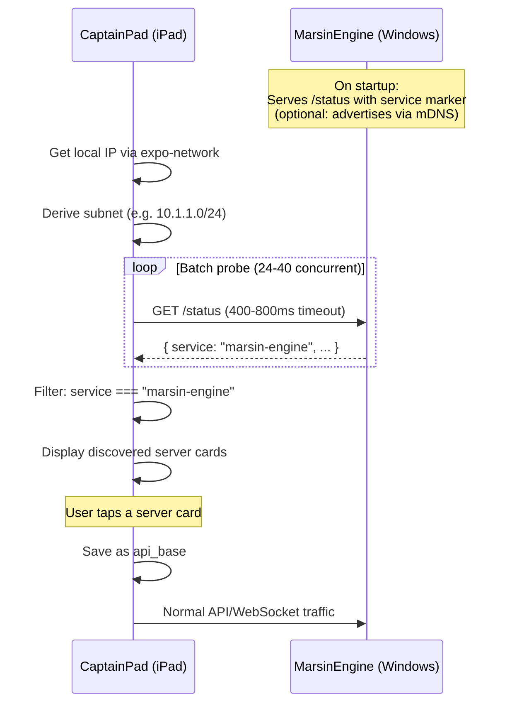

# CaptainPad Standalone iPad Deployment — Debug Report & Implementation Record

**Date:** 2026-05-02  
**Status:** ✅ Verified Working — Standalone `.ipa` connects to MarsinEngine  
**Component:** `CaptainPad/` (Expo SDK 54 + React Native 0.81)  
**Target:** iPadOS 17+ standalone `.ipa` via EAS Build (`preview` profile)  

---

## Executive Summary

The CaptainPad iPad app works correctly when run through Expo Go but fails to communicate with the MarsinEngine server when installed as a standalone `.ipa` from an EAS `preview` build. All API calls and WebSocket connections fail silently. The root cause is a combination of **missing iOS permission declarations** and an **iOS 17+ ATS policy change** that affects IP-address-based connections.

This report documents the root cause analysis, the specific configuration gaps, and records the implemented fix across 8 files.

---

## 1. Root Cause Analysis

### 1.1 — iOS 17+ ATS No Longer Allows Bare IP Addresses by Default

**This is the primary blocker.**

Starting in **iOS 17 / iPadOS 17** (September 2023), Apple changed the ATS (App Transport Security) policy. From Apple's official `NSAllowsLocalNetworking` documentation:

> In iOS 10 through iOS 16, iPadOS 13.1 through iPadOS 16, and macOS 10.12 through macOS 13, ATS allows all three of these connections by default, so you no longer need an exception for any of them.
>
> **In iOS 17, iPadOS 17, and macOS 14, ATS no longer allows connections to IP addresses by default.** Add individual IP addresses and classless inter-domain routing (CIDR) ranges in the `NSExceptionDomains` dictionary.

The previous `app.json` only set:
```json
"NSAppTransportSecurity": {
  "NSAllowsLocalNetworking": true
}
```

Per Apple's docs, `NSAllowsLocalNetworking` covers unqualified domains, `.local` domains, and IP addresses — but the iOS 17+ change means explicit CIDR ranges in `NSExceptionDomains` are now required for reliable IP-based connections. Apple's recommended pattern is to set **both** `NSAllowsLocalNetworking` and `NSAllowsArbitraryLoads` to `YES`:

> The local networking exception tells newer versions of the OS to ignore the arbitrary loads key, and enable access to unqualified domains, .local domains, and IP addresses that they would otherwise restrict. Meanwhile, the arbitrary loads key tells older versions of the OS, which don't process the local networking exception key, to bypass ATS completely.

### 1.2 — Missing `NSBonjourServices` Declaration

The app declared `NSLocalNetworkUsageDescription` (the user-facing permission string), but did **not** declare `NSBonjourServices`. On iOS 14+, the Local Network permission dialog behavior requires `NSBonjourServices` to be declared for reliable prompt triggering. Without it, the system may not show the permission dialog, and local network traffic fails silently.

### 1.3 — Expo Go vs. Standalone Permission Divergence

**Why it works in Expo Go but not standalone:**

Expo Go is a pre-built app with **all iOS permissions pre-configured**, including `NSAllowsArbitraryLoads: true`, `NSBonjourServices` with wildcard entries, and Local Network permission already granted. When you build a standalone `.ipa` with `eas build --profile preview`, the app gets a fresh `Info.plist` generated from your `app.json`. Missing keys in `app.json` = missing permissions in the standalone build.

### 1.4 — Missing `NSAllowsArbitraryLoadsInWebContent`

The Monitor tab uses `react-native-webview` to load the Three.js simulation over HTTP (`http://<engine-host>:6969/simulation/`). Without `NSAllowsArbitraryLoadsInWebContent`, WebView HTTP loads are blocked by ATS on iPadOS 17+.

### 1.5 — Silent Failure in API Layer

The original `utils/api.ts` caught all errors with `console.warn` and returned empty/null results. The user saw an empty pattern list and non-functional controls with **zero feedback** that the server was unreachable. Critical for Burning Man where network diagnosis must be fast.

---

## 2. Configuration Audit (Before → After)

### `app.json` iOS Block

| Key | Before | After | Notes |
|-----|--------|-------|-------|
| `orientation` | `"portrait"` | `"default"` | iPad control surface needs landscape |
| `NSAllowsLocalNetworking` | `true` | `true` | Retained |
| `NSAllowsArbitraryLoads` | **MISSING** | `true` | Backward compat for iOS <17 |
| `NSAllowsArbitraryLoadsInWebContent` | **MISSING** | `true` | WebView HTTP in Monitor tab |
| `NSExceptionDomains` | **MISSING** | 2 universal CIDR ranges | iOS 17+ requirement |
| `NSExceptionDomains` — `0.0.0.0/0` | — | `NSExceptionAllowsInsecureHTTPLoads: true` | All IPv4 addresses (any subnet) |
| `NSExceptionDomains` — `::/0` | — | `NSExceptionAllowsInsecureHTTPLoads: true` | All IPv6 addresses |
| `NSLocalNetworkUsageDescription` | Present (short) | Updated (descriptive) | Better user-facing copy |
| `NSBonjourServices` | **MISSING** | `["_marsinengine._tcp"]` | Future-proofs local network prompt (no trailing dot) |

### Config Introspection Verification

```
$ npx expo config --type introspect
```

✅ All keys confirmed present in resolved config:
- `NSAllowsLocalNetworking: true`
- `NSAllowsArbitraryLoads: true`
- `NSAllowsArbitraryLoadsInWebContent: true`
- `NSExceptionDomains` with 3 CIDR ranges
- `NSBonjourServices: ['_marsinengine._tcp.']`
- `NSLocalNetworkUsageDescription` present
- All 4 iPad orientations enabled (`UISupportedInterfaceOrientations~ipad`)

---

## 3. Implemented Changes

### 3.1 — `app.json` — ATS & Permissions Fix

Full corrected iOS ATS block:

```json
"NSAppTransportSecurity": {
  "NSAllowsLocalNetworking": true,
  "NSAllowsArbitraryLoads": true,
  "NSAllowsArbitraryLoadsInWebContent": true,
  "NSExceptionDomains": {
    "0.0.0.0/0": {
      "NSExceptionAllowsInsecureHTTPLoads": true
    },
    "::/0": {
      "NSExceptionAllowsInsecureHTTPLoads": true
    }
  }
},
"NSLocalNetworkUsageDescription": "CaptainPad needs local network access to communicate with the MarsinEngine lighting controller on your LAN.",
"NSBonjourServices": ["_marsinengine._tcp"]
```

**Expert caveats:**
- Universal CIDR (`0.0.0.0/0` + `::/0`) covers any network topology: 10.x, 192.168.x, 172.16.x, hotspot, link-local, IPv6.
- This applies to IP literals only, not arbitrary DNS hostnames.
- `NSLocalNetworkUsageDescription` remains separate from ATS — it controls the iOS local-network privacy prompt.
- `NSBonjourServices` uses `_marsinengine._tcp` without trailing dot (iOS may not accept the dotted form).

### 3.2 — `utils/api.ts` — Network Health Primitives

**New exports:**
- `getApiBaseAsync()` — Awaitable API base resolution. Screens must call this before their first fetch to avoid racing AsyncStorage on cold start.
- `testConnection(baseUrl?)` — Probes `/status` with a 3-second `AbortController` timeout. Returns `{ ok, data, error, latencyMs }`.
- `ApiResult<T>` — All API methods now return `{ ok: boolean, data?: T, error?: string }` instead of raw data or `null`. Callers can distinguish "empty data" from "network offline".

### 3.3 — `app/(tabs)/index.tsx` — Connection-Aware Control Deck

- Calls `getApiBaseAsync()` before any network operation.
- Tracks `isConnected` state (null = checking, true/false = result).
- Shows `ENGINE OFFLINE` banner with error details when server is unreachable.
- WebSocket auto-reconnects on close (5-second backoff).
- Reconnects on `AppState` change to `active` (app returns from background).
- Replaced `fetchPatterns().then(setPatterns)` with structured `ApiResult` unwrapping.

### 3.4 — `app/(tabs)/config.tsx` — Enhanced Configuration

Three sections:
1. **Connection Status** — Green/red indicator dot with glow, latency display, server details (active pattern, model, scene) when connected, error message when not.
2. **Engine API Base URL** — Text input with "Currently resolved: ..." label, Save/Reset buttons, auto-tests connection after save.
3. **iPad Local Network Guidance** — Warning card explaining how to check Settings → Privacy & Security → Local Network → CaptainPad. Includes "OPEN iPAD SETTINGS" deep-link button.

New: **Test Connection** button that probes `/status` and displays structured result.

### 3.5 — `app/(tabs)/monitor.tsx` — Resilient Monitor

- Awaits `getApiBaseAsync()` before any fetch.
- Tests connection first; shows full-screen ENGINE OFFLINE state with error details and guidance instead of a blank/broken WebView.
- Computes stream URL only after getting valid `/status` data.
- Shows "CONNECTING..." placeholder during async resolution.
- HUD shows engine status as ONLINE/OFFLINE/CHECKING.

### 3.6 — Compatibility Updates

- `studio.tsx` — Updated to unwrap `ApiResult<T>` from `fetchPatterns()`, `fetchPatternCode()`, `savePatternCode()`.
- `dimmer_rack.tsx` — Updated to unwrap `ApiResult<T>` from `fetchDimmers()`.
- `NauticalFader.tsx` — Fixed pre-existing duplicate `isColor` prop in interface definition.

---

## 4. Validation Results

| Check | Result |
|-------|--------|
| `npx expo config --type introspect` | ✅ All ATS keys, CIDR ranges, Bonjour, orientations confirmed |
| `npx tsc --noEmit` | ✅ Clean (only pre-existing `@/configs.yaml` module type — metro handles at runtime) |
| `GET /status` on running engine | ✅ `{"activeScene":"test_bench","activeModel":"test_bench","activePattern":"03_dual_axis_crush","unrealState":"streaming"}` |
| EAS Build | 🔄 In progress: `eas build --platform ios --profile preview --clear-cache` |

---

## 5. iPad-Side Validation Checklist

After the EAS build completes and the `.ipa` is installed:

- [ ] **Delete the old CaptainPad app** from the iPad before installing. This resets the Local Network permission state.
- [ ] **First-launch test**: Open app → confirm iOS Local Network permission prompt appears → tap "Allow".
- [ ] **Config tab**: Tap "Test Connection" → verify green "CONNECTED" indicator with server details and latency.
- [ ] **Control Deck**: Verify pattern list populates, sliders and macros respond.
- [ ] **Monitor tab**: Verify WebView loads the simulation (or shows descriptive OFFLINE state if sim server not running).
- [ ] **Denial test**: Go to iPad Settings → Privacy & Security → Local Network → toggle CaptainPad OFF → reopen app → confirm ENGINE OFFLINE banner appears with guidance text instead of empty/broken controls.
- [ ] **Re-enable test**: Toggle CaptainPad back ON in Settings → return to app → verify reconnection.

---

## 6. Build & Deployment Reference

### Prerequisites
- Apple Developer account with valid provisioning profile
- EAS CLI installed and authenticated
- iPad UDID registered in Apple Developer portal

### Build Commands
```bash
cd CaptainPad

# Verify config before building
npx expo config --type introspect

# Register device if needed
eas device:create

# Build standalone IPA (clear-cache recommended after config changes)
eas build --platform ios --profile preview --clear-cache
```

### EAS Profiles

| Profile | Uses Dev Server? | Distribution | Use Case |
|---------|-----------------|-------------|----------|
| `development` | Yes | Internal | Hot-reload debugging |
| **`preview`** | **No** | **Internal (ad-hoc)** | **Burning Man deployment** |
| `production` | No | App Store | Not applicable |

---

## 7. Files Modified

| File | Change |
|------|--------|
| `CaptainPad/app.json` | ATS CIDR exceptions, NSAllowsArbitraryLoads, NSAllowsArbitraryLoadsInWebContent, NSBonjourServices, orientation |
| `CaptainPad/utils/api.ts` | `testConnection()`, `getApiBaseAsync()`, `ApiResult<T>` wrapper on all methods |
| `CaptainPad/app/(tabs)/index.tsx` | Async API base, connection tracking, WS auto-reconnect, OFFLINE banner |
| `CaptainPad/app/(tabs)/config.tsx` | Connection status, Test Connection, server details, iPad guidance |
| `CaptainPad/app/(tabs)/monitor.tsx` | Async API base, full-screen offline state, URL recomputation |
| `CaptainPad/app/(tabs)/studio.tsx` | ApiResult unwrapping |
| `CaptainPad/app/(tabs)/dimmer_rack.tsx` | ApiResult unwrapping |
| `CaptainPad/components/NauticalFader.tsx` | Duplicate prop fix |

---

## 8. Risk Assessment

| Risk | Severity | Mitigation |
|------|----------|------------|
| iOS denies Local Network permission silently | **HIGH** | Fixed: NSBonjourServices + user guidance in Config tab |
| ATS blocks IP connections on iPadOS 17+ | **HIGH** | Fixed: CIDR exceptions + NSAllowsArbitraryLoads fallback |
| WebView blocked for HTTP simulation | **MEDIUM** | Fixed: NSAllowsArbitraryLoadsInWebContent |
| Server IP changes on playa (DHCP) | **MEDIUM** | Mitigated: Config tab now shows connection status; Phase 2 adds discovery |
| `NSAllowsArbitraryLoads` rejected by App Store | **NONE** | Not submitting to App Store; ad-hoc distribution only |

---

# Phase 2 — Server Discovery

**Status:** Planned  
**Depends on:** Phase 1 (standalone connectivity fix — ✅ complete)

Phase 1 fixed the *permission* problem. Phase 2 fixes the *address* problem — automatically finding MarsinEngine on any LAN without hardcoded IPs.

## 9. Implementation Plan

### 9.1 — Server Identity Contract

Extend `GET /status` (or add `GET /identity`) on MarsinEngine to return a clear service marker:

```json
{
  "service": "marsin-engine",
  "name": "MarsinEngine",
  "version": "2.0",
  "port": 6968,
  "activeModel": "...",
  "activePattern": "..."
}
```

This prevents CaptainPad from accepting any random HTTP server that happens to be listening on port 6968. Discovery probes will check `service === "marsin-engine"` before accepting a response.

#### [MODIFY] `marsin_engine/lib/api_server.js`
- Extend the existing `/status` response with `service`, `name`, `version`, `port` fields.

---

### 9.2 — Add `expo-network` to CaptainPad

Use `expo-network` to get the iPad's current LAN IP at runtime, then derive the `/24` subnet:

```
10.1.1.42  →  10.1.1.1 .. 10.1.1.254
192.168.1.5 → 192.168.1.1 .. 192.168.1.254
```

Manual URL entry remains as a fallback for non-standard networks.

#### [MODIFY] `CaptainPad/package.json`
- Add `expo-network` dependency.

---

### 9.3 — Build Subnet Scan Hook

#### [NEW] `CaptainPad/hooks/useServerDiscovery.ts`

Core logic:
- Get device IP via `expo-network` → `getIpAddressAsync()`
- Derive the `/24` subnet (replace last octet with `1..254`)
- Probe each `http://<candidate-ip>:6968/status` with a **400–800ms timeout**
- Run probes in **batches of 24–40 concurrent** `fetch()` requests
- Accept only responses where `service === "marsin-engine"` (or matching status shape)
- Return discovered servers with: `{ ip, url, model, pattern, latencyMs }`

```typescript
interface DiscoveredServer {
  ip: string;
  url: string;
  name: string;
  activeModel: string;
  activePattern: string;
  latencyMs: number;
}

interface UseServerDiscovery {
  servers: DiscoveredServer[];
  scanning: boolean;
  progress: number;       // 0..1
  subnet: string | null;  // e.g. "10.1.1"
  scan: () => void;
  error: string | null;
}
```

---

### 9.4 — Upgrade Config UI

Enhance the Config tab (already rebuilt in Phase 1) with discovery features:

1. **Scan Network** button — triggers `useServerDiscovery.scan()`
2. **Scan progress** — animated bar showing `Scanning 10.1.1.0/24... (142/254)`
3. **Discovered server cards** — tappable cards showing server name, IP, active pattern, model, latency
4. **Auto-fill** — tapping a card saves the IP as `api_base` and re-tests connection
5. **Preserved controls** — Test Connection button and manual URL input remain

```
┌─────────────────────────────────────────┐
│  CONNECTION STATUS  ● CONNECTED  12ms   │
│  Pattern: rainbow  Model: titanic       │
├─────────────────────────────────────────┤
│  [SCAN NETWORK]                         │
│  Scanning 10.1.1.0/24... ████░░ 56%    │
│                                         │
│  ┌─ MarsinEngine ──────────────────┐    │
│  │  10.1.1.172:6968  •  14ms       │    │
│  │  Pattern: rainbow               │    │
│  │  Model: titanic                 │    │
│  └──────────────────────────────────┘    │
├─────────────────────────────────────────┤
│  ENGINE API BASE URL                    │
│  [http://10.1.1.172:6968          ]     │
│  [SAVE CONFIG]  [RESET TO YAML]         │
├─────────────────────────────────────────┤
│  ⚠ iPAD LOCAL NETWORK PERMISSION       │
│  Settings → Privacy → Local Network ... │
└─────────────────────────────────────────┘
```

---

### 9.5 — Shared Connection State

Create a lightweight connection-status context shared across all tabs:

#### [NEW] `CaptainPad/hooks/useConnectionStatus.ts` (or context)

- Polls `/status` every 5 seconds
- Exposes `{ isConnected, latencyMs, serverInfo, error }`
- Sidebar shows green/red dot based on this state
- Config screen consumes the same result (no duplicate polling)
- Control Deck uses it for the OFFLINE banner

---

### 9.6 — Optional: mDNS Advertisement (Engine Side)

As a future enhancement, add `bonjour-service` to `marsin_engine` to advertise `_marsinengine._tcp`:

```javascript
const { Bonjour } = require('bonjour-service');
const bonjour = new Bonjour();
bonjour.publish({
  name: 'MarsinEngine',
  type: 'marsinengine',
  port: 6968,
  txt: { version: '2.0' }
});
```

> **Note:** Do NOT add native mDNS browsing to the Expo app — it adds native dependency risk and complicates EAS builds. The HTTP subnet scan is simpler and sufficient for playa/local LAN use. mDNS on the engine side is useful for non-CaptainPad clients (e.g., debugging from a laptop).

---

## 10. Testing Plan

| Test | Method |
|------|--------|
| URL normalization + subnet generation | Unit test: `10.1.1.42` → `10.1.1.1..254` |
| Scan against fake `/status` | Mock: verify `service === "marsin-engine"` filter works |
| Scan on current WiFi | iPad on LAN with engine at `10.1.1.172` — verify card appears |
| Server at new IP | Move engine to different IP → scan again → confirm new card |
| Local Network denied | Disable permission in iPad Settings → confirm useful error in Config UI |
| Server down | Stop engine → confirm card disappears on next scan |
| Wrong port | Server on non-6968 port → confirm not falsely discovered |
| Standalone build | Build `eas --profile preview` → install `.ipa` → full discovery flow |

---

## 11. Implementation Phasing

| Pass | Scope | Details |
|------|-------|---------|
| **Pass 1** ✅ | Status / Test Connection / Shared State | Phase 1 complete: `testConnection()`, `getApiBaseAsync()`, `ApiResult<T>`, connection-aware UI across all tabs |
| **Pass 2** | Server Identity + Subnet Scan | Add `service` field to `/status`, build `useServerDiscovery` hook, integrate into Config tab |
| **Pass 3** | Shared Connection Context + Sidebar | Extract connection polling into a shared context, add sidebar status dot, de-duplicate polling |
| **Pass 4** (optional) | mDNS Advertisement | Add `bonjour-service` to engine, future-proofs for non-CaptainPad clients |

---

## 12. Architecture Diagram


