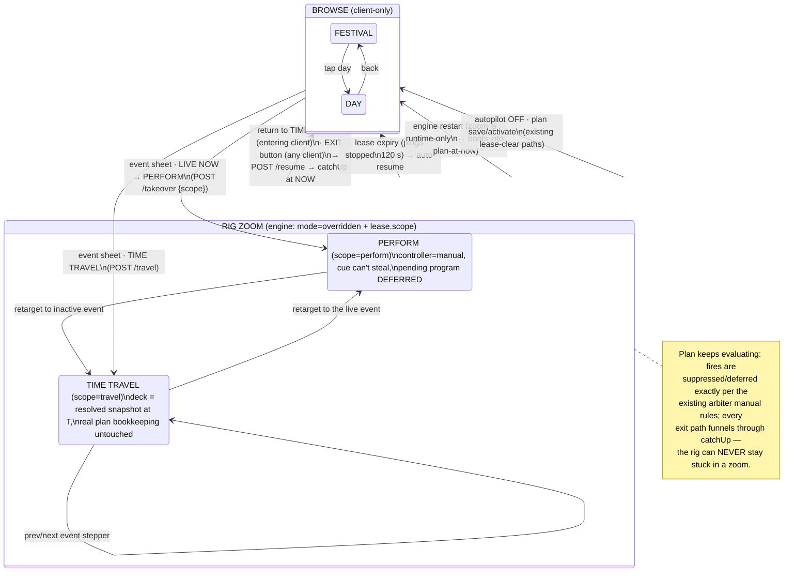

# `_94` — Timeline zoom DESIGN: day zoom + event zoom (perform / time travel)

**Operator feature request (2026-07-31, verbatim):**

> *Feature 1 — day zoom:* "day zoom for the timeline — like calendar showing
> week or day — I want a feature like that so I can review the timeline."
>
> *Feature 2 — event zoom:* "this will zoom into the event and let me control
> the deck without having the main cue change control, and when zoom out, it
> will resume the cue -> this is performance level. The way it works is that we
> can click on the event and zoom into that plan; if it's active and running,
> it will let us run the live program. If it's not active, we temporarily time
> travel to that event and let the user see the deck at that moment and work
> with the deck. Going back to the timeline tab is how to get out of the time
> travel feature."
>
> Constraint: "try to keep the UI simple and easy to understand moving forward."

**DESIGN-ONLY thread.** Zero code changes, zero scene writes, zero device
traffic, no git operations. The only writes are this report and the two ledger
docs. Builds are separate slices for the coordinator (§11).

**Headline:** both features fall out of machinery that already exists. Day
zoom is a promotion of the maker's existing 8-day strip + day editor into an
explicit FESTIVAL → DAY → EVENT navigation ladder, fed by two small additive
overview extensions (per-day phases + a resolved "what actually plays"
ribbon). Event zoom is **a scoped operator takeover** — the human layer the
arbiter already puts above everything (`arbiter.js:5-18`) — with a `scope`
tag (`perform` | `travel`) and exactly one genuinely new engine capability: a
**pure "resolve the plan's deck state at time T"** function extracted from
`_catchUp`, which is also the missing primitive the day-zoom ribbon and the
`_93` dry-run harness's assertions can share. No new controller value, no
parallel ownership mechanism, no reintroduction of PAUSE/HOLD.

---

## 0. Grounding — what exists today (all claims cited)

| Fact | Evidence |
|---|---|
| Arbiter precedence is MANUAL > PROGRAM > AUTOPILOT; manual = mode `overridden` or autopilot-off-no-program | `marsin_engine/lib/timeline/arbiter.js:5-18, 74-86, 114-122` |
| Operator takeover = `mode:'overridden'` + an `operatorLease {expiresAtMs}`; refreshed by `/timeline/activity`, auto-releases via `_releaseOperatorLease` → `_catchUp` (resume-at-now) | `timeline_service.js:2424-2485` |
| `resume()` is the explicit hand-back; PAUSE/HOLD were removed — takeover is the ONLY manual interruption and it always auto-resumes | `timeline_service.js:2386-2412`, `timeline_state.js:126-128` |
| A program due under manual arms a **pending lease** that AUTO-STARTS after `programLeaseSec` (30 s) — "the show goes on even during a manual takeover (I2)" — and this **overrides an active takeover** (`leaseAutoStarted` forces controller `program`) | `arbiter.js:87-104, 119` |
| `_catchUp` is "resolve the plan at now": picks the latest already-passed restorable clock/sun cue of today, re-anchors its window/hold, else falls to baseline/defaultCue; it also CLEARS activeProgram, pendingProgram, operatorLease, and orphaned `overridden` mode | `timeline_service.js:1663-1769, 1691-1706` |
| Party-session resume semantics after a takeover already exist: end (not-resumed, cooldown stamped at true end) vs rejoin-remaining-window, decided in `_catchUp` | `timeline_service.js:1809-1855` |
| `operatorLease` and `pendingProgram` are runtime-only — a restart never resumes them | `timeline_service.js:1691-1706`, `timeline_state.js:144-150` |
| The whole service is clock-injected (`nowFn`) — the `_93` harness drives the REAL service + REAL playlist resolution offline with a fast clock and recording deps | `timeline_service.js:233`, `marsin_engine/tools/timeline_dryrun.mjs:9-27, 459-564, 716-737` |
| Engine REST surface: `/timeline/state·overview·plans·plan/activate·autopilot·resume·takeover·activity·program/{end,enable,dismiss}·cues/:id/fire`; state also broadcast as `timelineState` on `/ws/control` | `marsin_engine/lib/api_server.js:5921-6099`, `CaptainPad/hooks/useTimeline.ts:1-14` |
| `savePlan` over the ACTIVE plan hot-reloads + runs `_catchUp` — which (per the row above) drops any takeover lease. The always-editing maker auto-saves. | `timeline_service.js:2326-2344`, `CaptainPad/app/(tabs)/timeline.tsx:246-253` |
| CaptainPad TIMELINE tab already has: the 8-day `DayOverviewStrip` (24 h sun columns, cue blocks for `durationMin` cues, point markers, NOW playhead, today highlight), a `DayEditor` modal, `CueEditorSheet`, plan-tz "now" math | `CaptainPad/components/timeline/DayOverviewStrip.tsx:1-33, 93-121`, `timeline.tsx:84-112, 261-277` |
| Deck/mixer already share one takeover hook (`useOperatorTakeover`: first touch → `/takeover`, throttled `/activity` pings, live countdown) | `CaptainPad/hooks/useTimeline.ts:252-339` |
| `GET /timeline/overview` carries per-day sun + cues (`atLocal`, `durationMin`) but **NOT phases** and **NOT the resolved gap-fillers**; `/timeline/state.phases` is today-only | `timeline_service.js:98-165`, `CaptainPad/utils/timelineApi.ts:453-489, 171` |
| Known gaps this design touches (from `_91`): postpone/shift MISSING (§4.2), hold-expiry lands on the autopilot baseline not `ambient` (G1), no way to see a night without waiting (→ `_93`) | `.agent/reports/202607/20260725_91_show_infra_audit.md` §3-4, G1 |

Division-of-concerns rule honored throughout: **CaptainPad owns HANDLING
(navigation, zoom gestures, banners); the engine owns persisted/authoritative
state (who controls the rig, what the deck was told to do).**

---

## 1. The navigation model — one ladder, three rungs

One coherent mental model, no new concepts beyond "zoom in / zoom out":

```
FESTIVAL  ──tap a day──▶  DAY  ──tap an event──▶  EVENT (the deck itself)
 (week view:               (calendar day view:      LIVE  → PERFORM the show
  8 day cards,              phases, sun, cues,      else  → TIME TRAVEL there
  today highlighted)        resolved ribbon)
      ◀──back───────────────┘   ◀──return to TIMELINE tab = zoom out──┘
```

- **FESTIVAL** and **DAY** are pure *browse* levels — client-side navigation,
  zero engine effect. Reviewing the timeline never touches the rig.
- **EVENT** is the only level that touches the rig, and it does so through the
  arbiter's existing human layer: entering it is a *scoped takeover*; leaving
  it is the existing `resume()` (plan resumes at now via `_catchUp`) — exactly
  "when zoom out, it will resume the cue".
- The event level does not build a second deck UI. It flips the app to the
  existing DECK tab under a full-width mode banner. "Going back to the
  timeline tab" — the operator's own exit gesture — is the zoom-out.

This reuses the tab structure, the strip, the day editor, the cue editor, the
takeover lease, catchUp, and the deck tab. The only new UI surfaces are one
small event sheet and one banner.

---

## 2. Feature 1 — DAY ZOOM

### 2.1 FESTIVAL level (week view)

The existing `DayOverviewStrip` **is** the week view; it stays the top level
unchanged in behavior, with two additive dressings:

```
┌ FESTIVAL ───────────────────────────────────────────────────────────────┐
│ ┌Sun──┐ ┌Mon──┐ ┌Tue──┐ ┌Wed──┐ ┌Thu──┐ ┌Fri──┐ ┌Sat──┐ ┌Sun──┐          │
│ │ d0  │ │ d1  │ │ d2🩰│ │ d3⬜│ │ d4  │ │ d5  │ │ d6🔥│ │ d7🏛│          │
│ │ ▒▒  │ │ ▒▒  │ │ ▒▒  │ │ ▒▒  │ │ ▒▒  │ │ ▒▒  │ │ ▒▒  │ │ ▒▒  │  ← sun   │
│ │ █   │ │ █   │ │ █   │ │ █   │ │ █   │ │ █   │ │ ██  │ │ ██  │  ← cues  │
│ │ ●━━ │ │TODAY│ │     │ │     │ │     │ │     │ │     │ │     │          │
│ └─────┘ └─────┘ └─────┘ └─────┘ └─────┘ └─────┘ └─────┘ └─────┘          │
│              tap a card → DAY view                                       │
└──────────────────────────────────────────────────────────────────────────┘
```

- **Theme badges** on day cards: derived client-side from that day's program
  cues (a `days:[6]` cue only appears on day 6 in the overview —
  `timeline_service.js:128`, `festival.js:58-73` — so the badge is just the
  day's program-cue label, no new wire data).
- Tap = zoom to DAY (today's card already carries the NOW playhead).

### 2.2 DAY level (calendar day view)

Promote the existing `DayEditor` from a modal to a full zoom level and enrich
it with the two things a *review* needs that the maker never had — **phases**
and **the resolved truth of what actually plays**:

```
┌ DAY 4 · Thu ─────────────── ◀ prev day | next day ▶ ────────── [WEEK] ──┐
│ 12:00 ─────────────────────────────────────────────────────────────────│
│        (daylight band)                          RIBBON (resolved):     │
│ 19:4x  ☀ sunset−30 ┌philharmonic phase┐        ┌──────────────────────┐│
│        ▶ c_visibility_on  [program, hold 90m]  │ default (baseline!) ⚠ ││
│ 21:xx  │ hold ends → ribbon shows `default`    │  ← the _91 G1 gap,   ││
│ 22:xx  ┌party_night phase────────────────────┐ │    now VISIBLE       ││
│        ▶ c_party_start [ambient, no expiry]    │ party·default 8h ⚠   ││
│  ~~~   ♪ mood cue (when music) — marker only   │                      ││
│ 05:xx  ▶ c_sunrise [program, hold 90m]         │ sunrise look         ││
│ 07:xx  └── phases end                          │ ambient (defaultCue) ││
│ ───●── NOW playhead (today only)               └──────────────────────┘│
│  tap an event → EVENT sheet     long-press → edit (CueEditorSheet)     │
│  [ reserved slot: SHIFT TONIGHT +…  — the postpone affordance, _91 §3 ]│
└─────────────────────────────────────────────────────────────────────────┘
```

Content, per day (times re-resolved per day — sun anchors shift):

1. **Phase bands** — needs a small additive engine change: `buildOverview`
   gains per-day `phases: [{name, startLocal, endLocal}]` resolved through
   the existing `resolveDayTimes` math (`triggers.js:101-125`). Today phases
   are only on `/timeline/state` for *today* (`timelineApi.ts:171`).
2. **Cue blocks + markers** — already rendered (blocks for `durationMin`,
   markers for points, mood cues as untimed chips —
   `DayOverviewStrip.tsx:93-121`); reuse the same components at day scale.
3. **The resolved ribbon** — a per-day segment list of *what actually owns
   the deck and which playlist plays*, computed engine-side by the shared
   resolver (§4.1). This is the honesty layer: it will show, correctly, that
   the sunset+45→sunset+120 gap runs playlist `default` under the autopilot
   baseline (G1) and that `party` owns ~8 h (G2). **The ribbon renders the
   truth of the shipped plan; it does not fix it** — fixing it is the `_91`
   Phase 1 authoring conversation.
4. **Editing** stays exactly the maker's: long-press (or an edit chip) opens
   the existing `CueEditorSheet`. Day zoom adds *no* new edit semantics.
5. **Postpone slot** — the day header reserves one control slot
   (`SHIFT TONIGHT +…`) where `_91` §3.1's recommended `planOffsetMin` shape
   would live when the operator green-lights that build. Reserved, not built:
   day zoom is where a shift is *reviewed* (every band/block moves together),
   so it is the natural home.

Read-only vs editing verdict: **browse levels are read-safe by construction**
(no engine calls), and editing remains exactly where it already is. No new
"edit mode" concept.

### 2.3 What day zoom deliberately does NOT do

- No per-client calendar library, no month view — the festival is ≤ 8-31 days
  (`festival.js`), one WEEK row + one DAY view covers the operator's ask.
- No second rendering of party sessions as scheduled blocks — mood cues are
  music-driven and stay markers ("when music"), matching reality.

---

## 3. Feature 2 — EVENT ZOOM

### 3.1 The event sheet (tap an event at DAY level)

One sheet, one primary action, branch chosen by the engine's own state — is
this cue the live deck owner right now (`state.activeCue`,
`timelineApi.ts:82-89`)?

```
┌ c_party_start · "Party night" ──────────────────────────┐
│ ambient · fires sunset+120 · owns deck until next cue   │
│ look: party → playlist default · palette bass_drop      │
│                                                         │
│   ● LIVE NOW               (only when it owns the deck) │
│  ┌────────────────────┐   ┌───────────────────────────┐ │
│  │  🎚 PERFORM         │   │  🕰 TIME TRAVEL HERE       │ │
│  │  take the deck —    │   │  show the ship what this  │ │
│  │  plan holds         │   │  moment looks like        │ │
│  └────────────────────┘   └───────────────────────────┘ │
│  ✎ Edit cue                                    Cancel   │
└─────────────────────────────────────────────────────────┘
```

Both actions land in the same place — **the DECK tab, under a banner** — and
both exit the same way. One mental model: *zooming into an event hands YOU
the deck; zooming out hands it back to the plan.*

### 3.2 LIVE mode — PERFORM (event is active and running)

**Mapping onto the arbiter — no parallel mechanism.** Perform *is* the
existing operator takeover: `mode:'overridden'`, `controller:'manual'`,
`operatorLease` armed — the human layer that already outranks program and
autopilot (`arbiter.js:74-86`). The single addition is a **scope tag** on the
lease (`scope:'perform'`, plus the cue id for the banner). Under manual, the
existing suppression already delivers most of the requirement:

- mood cues are suppressed (surfaced as `wouldFire`) — `arbiter.js:174-180`;
- ambient/deck cues don't apply — `arbiter.js:181-186`;
- the deck stays exactly where the performer leaves it.

**The one real gap — and the honest change.** Today a program cue that comes
due during a takeover arms a pending lease that **auto-starts after 30 s**
and seizes the controller even from a takeover (`arbiter.js:87-104, 119` —
deliberate: "the show goes on"). That is precisely the "main cue change
control" the operator wants excluded while zoomed. Proposal:

> While an operator lease with `scope ∈ {perform, travel}` is alive, the
> service **defers** the pending-program auto-start: each tick it pushes
> `pendingProgram.expiresAtMs` forward to the zoom lease's own expiry (a
> service-level nudge before `arbitrate()` — the arbiter itself stays pure
> and unchanged). The pending program is *deferred, never dismissed*: no
> `firedToday` latch, and the banner shows "Show due: Burn Night — starts
> when you exit" with the existing ENABLE button for "start it now".

On zoom-out, `resume()` → `_catchUp` re-derives the owner for NOW: a program
whose trigger passed mid-zoom is restored with its hold re-anchored to its
true fire time (`timeline_service.js:1719-1757`) — if the performer zoomed
straight through the whole hold window, it is honestly skipped. Plain
takeovers (deck fader grabs, scope absent) keep today's auto-start behavior
byte-identical.

**Phase/cue boundary passes while zoomed:** nothing moves (manual owns the
deck); the banner shows the next boundary ("next: c_sunrise 05:4x") so the
performer sees it coming; exit lands on the correct owner via catchUp.

**Party session mid-flight:** entering perform is a takeover, so the
*existing* end-vs-rejoin rules apply unchanged on exit
(`timeline_service.js:1809-1855`): rejoin only if policy on + window remains
+ music still playing, else the session ends with the cooldown stamped at its
true end. No new party rules.

**Lease keep-alive — presence, not touch.** A performer may watch the rig
hands-off for minutes; the plain takeover's touch-driven pings
(`useTimeline.ts:289-323`) would let the lease lapse mid-performance. While
the zoom banner is mounted and the app is foregrounded, CaptainPad pings
`/timeline/activity` every ~30 s. App backgrounded / iPad dead / WiFi gone →
pings stop → the lease expires (`operatorLeaseSec`, 120 s) → the plan
auto-resumes. **The "never stuck" invariant survives every failure mode.**

### 3.3 TIME TRAVEL mode (event not active)

The operator's words — "let the user see the deck at that moment and **work
with the deck**" — mean the REAL deck (ship/bench) plays the time-traveled
state. Design:

**What drives the deck.** On `POST /timeline/travel {date, time|cueId}` the
engine (1) enters the same scoped takeover (`scope:'travel'`), then (2)
computes the plan's deck state at target time T with the **pure resolver**
(§4.1) — which cue would own the deck, else defaultCue, else baseline — and
(3) applies that one snapshot through the **normal dispatch path**
(`_dispatchCue`-equivalent), exactly like catchUp applies a restored cue.
The live plan's bookkeeping is untouched: **no `firedToday` latches, no
cooldown stamps, no activeProgram, no persisted-state writes for the
simulated day** — the resolver is read-only and the apply happens under the
human layer.

**Explicitly rejected: warping the live service's clock.** Wrapping the live
`nowFn` with an offset and re-running catchUp *would* reuse the `_93` clock
machinery most literally, but catchUp latches `firedToday` for every passed
cue of the (simulated) day (`timeline_service.js:1726`) — traveling to
tonight-at-sunset this afternoon would mark tonight's cues fired and the real
night would silently not happen. Codex P0 says fail loud, never lie; a
clock-warped live service lies to itself. The shared-mechanism requirement is
honored one level down instead (§4.1).

**Static in plan-time.** The traveled snapshot does not tick (no simulated
cue transitions while you watch); the deck's own pattern autopilot still
cycles live, and the operator has full manual control (that's the point —
"work with the deck"). The banner offers `◀ prev event | next event ▶`
steppers that re-resolve + re-apply, so walking a night event-by-event is two
taps, not re-navigation.

**Unmistakable + safe:**

- Full-width purple banner on every control surface (deck, mixer, timeline):
  `🕰 TIME TRAVELING — Thu · sunset+45 · viewing the plan, not tonight —
  [◀][▶]  EXIT`. Distinct from the green PERFORM banner and the existing
  yellow plan-lock.
- Second CaptainPad clients see the same banner (rig state broadcasts on
  `timelineState`) — nobody can walk up to a pad and not know.
- **Auto-exit rules** (any one suffices): return to the TIMELINE tab
  (operator's gesture) · EXIT button · lease expiry (presence pings stopped)
  · engine restart (zoom state is runtime-only; boot catchUp already clears
  lease + overridden mode, `timeline_service.js:1691-1706` — the ship wakes
  up in the present, always) · autopilot OFF (existing lease-clear path,
  `:2520-2522`) · plan save/activate (both run `_catchUp`, which already
  drops takeovers — inherited behavior, now documented: **editing the plan
  while zoomed exits the zoom**).
- Out-of-festival-window: `takeover()` already refuses to arm out of window
  (`:2430-2432`); travel is *allowed* while dormant (that is exactly when the
  operator rehearses — today's rig state) but only to in-window targets, and
  the dormant plan resumes to dormancy on exit (`_goDormant` via catchUp).

**What happens to the real program while traveling:** the same thing that
happens during any takeover — it is suppressed by the human layer and
resumes at now on exit. Time travel adds zero new suppression semantics.

### 3.4 Relationship to the `_93` dry-run harness

The harness proved the whole timeline stack is nowFn-driven and drives the
REAL service offline (`timeline_dryrun.mjs:9-27`). This design **shares its
mechanism at the resolution layer rather than adding a second clock-injection
path into the live engine**:

- The pure resolver (§4.1) is extracted from `_catchUp`'s selection core —
  the same logic the harness exercises via `svc.start()`/`_tick()`.
- A cross-check test pins them together: for a sampled set of instants, the
  resolver's answer must equal what a dry-run-style throwaway service
  (recording deps, injected clock — the `makeDryRunDeps` recipe,
  `timeline_dryrun.mjs:459-564`) lands on. If they ever diverge, the build
  fails loudly.
- Alternative considered (§10 D5): implement `/timeline/resolve` by spinning
  that throwaway service in-process per call. Maximum fidelity, zero
  refactor, but heavier per call and it leaves catchUp's logic duplicated in
  spirit; extraction keeps ONE selection core used by catchUp, travel, the
  ribbon, and the cross-check.

---

## 4. Engine design

### 4.1 The shared pure resolver (the one new primitive)

Extract from `_catchUp` (`timeline_service.js:1719-1743` + the
baseline/defaultCue fallthrough) into `lib/timeline/` as a pure function:

```
resolveDeckStateAt({ plan, partyConfig, atMs })
  → { inWindow: bool,                     // festival gate (festival.js)
      phase: string|null,
      owner: { kind:'cue'|'defaultCue'|'baseline', cueId?, label },
      action: CueAction|null,             // what would be dispatched
      playlist: string|null, palette: string|null,
      windowUntilMs: number|null,         // re-anchored durationMin/hold
      controller: 'program'|'autopilot' } // what the controller would be
```

Pure: no IO, no Date.now(), same discipline as `triggers.js`/`arbiter.js`.
`_catchUp` is refactored to consume it (behavior-identical, pinned by the
existing 317 tests + the cross-check above). Consumers: catchUp · `POST
/timeline/travel` · `GET /timeline/resolve` · the day-ribbon builder
(sampled at that day's cue/phase boundaries — a handful of calls per day).

### 4.2 REST / WS surface

| Route | Change | Notes |
|---|---|---|
| `GET /timeline/overview` | **additive**: each day gains `phases:[{name,startLocal,endLocal}]` and `segments:[{fromLocal,toLocal,owner,playlist,palette,source}]` (the ribbon) | draft `POST /timeline/overview` gets the same for maker preview parity |
| `GET /timeline/resolve?date=YYYY-MM-DD&time=HH:MM` | **new** | read-only resolver peek (event sheet preview); 400 on out-of-window target |
| `POST /timeline/takeover` | **additive body** `{scope:'perform', cueId?}` | bodyless call = today's plain takeover, byte-identical |
| `POST /timeline/travel` | **new** `{date, time}` or `{cueId, dayIndex}` | enters scoped takeover + applies resolved snapshot; 400 on unresolvable/out-of-window target; idempotent retarget while already traveling |
| `POST /timeline/resume` | unchanged route | now also clears `zoom` (single exit for plain takeover, perform, travel) |
| `timelineState` broadcast / `GET /timeline/state` | **additive field** `zoom: null \| {scope:'perform'\|'travel', cueId?, label, targetMs?, pendingDeferred?: {cueId,label,dueAtLocal}}` | runtime-only; cleared everywhere `_catchUp` already clears the lease |
| tick | while zoom lease alive: defer `pendingProgram.expiresAtMs` (service-level, pre-`arbitrate`) | arbiter stays pure/unchanged |

### 4.3 Persistence & one-writer

- `zoom` and the scoped lease are **runtime-only**, exactly like
  `operatorLease`/`pendingProgram` today (`timeline_state.js:144-150`,
  cleared at `timeline_service.js:1691-1706`). Engine restart mid-zoom ⇒ the
  ship boots into the plan-at-now; CaptainPad sees `zoom:null` on the next
  `timelineState` and drops its banner + navigates back to TIMELINE with a
  toast ("zoom ended: engine restarted").
- **One writer:** there is ONE rig, ONE engine, ONE zoom state. Two
  CaptainPads never hold different zooms — a second client's PERFORM/TRAVEL
  request retargets the single engine session (last operator action wins,
  same as every other control write), and every client renders the same
  banner from the same broadcast. The *exit gesture* (returning to the
  TIMELINE tab) is client-local: it fires `resume()` only from a client that
  entered/joined the zoom UI; a client that never zoomed shows the banner
  with an explicit EXIT instead (so tab-browsing on pad B never yanks pad
  A's performance).

---

## 5. The state machine



Orthogonal axes and their answers:

| Axis | Behavior |
|---|---|
| program running when zoom starts | takeover suppresses it (existing); on exit catchUp re-derives (rejoin if hold remains, else next owner) |
| program becomes due mid-zoom | pending lease armed (existing) but auto-start DEFERRED (new, zoom scopes only); banner offers ENABLE; exit fires it via catchUp |
| party session mid-flight | existing end-vs-rejoin catchUp rules, unchanged (`:1809-1855`) |
| plan dormant (out of window) | browse levels fine; PERFORM impossible (nothing live, `takeover` refuses `:2430`); TRAVEL allowed to in-window targets, exit returns to dormancy |
| client disconnect / app sleep | presence pings stop → lease expiry → auto-resume (120 s) |
| engine restart mid-zoom | zoom dropped at boot (runtime-only) → plan-at-now; clients toast + fall back to TIMELINE |
| two clients | one engine session; retarget allowed; tab-return exit only from entering client; EXIT on every banner |
| maker auto-save mid-zoom | save → catchUp → zoom exits (inherited, documented); banner mentions it if it fires |

---

## 6. CaptainPad component plan

| Piece | New/changed | Content |
|---|---|---|
| `app/(tabs)/timeline.tsx` | changed | zoom-level nav state (FESTIVAL ↔ DAY full-screen); focus effect: on tab focus while this client is in a rig zoom → `resume()`; renders `ZoomBanner` |
| `components/timeline/DayOverviewStrip.tsx` | changed (light) | theme badges; tap = navigate (already does); shared `yForMinutes` untouched |
| `components/timeline/DayEditor.tsx` → `DayView` | changed (grow) | full-screen day: phase bands + resolved ribbon + prev/next day + reserved SHIFT slot; long-press → existing `CueEditorSheet` |
| `components/timeline/EventSheet.tsx` | **new (small)** | cue context (from overview + `/timeline/resolve` peek) + PERFORM / TIME TRAVEL / Edit |
| `components/ZoomBanner.tsx` | **new** | global, rendered on deck + mixer + timeline; green PERFORM / purple TRAVEL variants; countdown-free (presence-based); EXIT, prev/next steppers (travel), deferred-show notice + ENABLE |
| `hooks/useTimeline.ts` | changed | `zoom` on state; `performTakeover(cueId)`, `travel(target)` actions; `useZoomPresence()` — mounts with the banner, pings `/activity` every ~30 s while foregrounded, tracks "this client entered the zoom" |
| `utils/timelineApi.ts` | changed | wire types for `zoom`, `phases`, `segments`; `postTimelineTravel`, takeover body |
| deck/mixer screens | changed (light) | render `ZoomBanner`; existing `useOperatorTakeover` untouched for plain grabs |

Simplicity check against `.agent/os/ui_design.md` ("compact wins", tokens not
literals): zero new parallel UIs — the deck tab is reused whole; one sheet +
one banner are the only new components; every color from the theme tokens.
Learnable at 3 am: *tap what you want to see; the ship shows it; go back to
the timeline to give it back.*

---

## 7. Compatibility notes

**Byte-identical / untouched:** plan YAML schema + every existing plan file ·
arbiter module (stays pure, unchanged) · plain takeover via bodyless
`POST /timeline/takeover` and the deck/mixer touch-takeover flow · resume
semantics for plain takeovers · party config + session rules · `_93` harness
CLI and output · all existing `/timeline/*` responses (additions only) · the
8-day strip's current render at FESTIVAL level · the 317 timeline tests
(they must stay green through the catchUp refactor).

**Behavior changes (all scoped, all listed):**
1. Pending-program auto-start is deferred **only** under `scope ∈ {perform,
   travel}` — a plain takeover keeps I2 auto-start exactly as shipped.
2. New exit paths clear the new `zoom` field wherever the lease already
   clears (one code site: catchUp + the two toggle paths).
3. `GET/POST /timeline/overview` responses grow `phases` + `segments`
   (additive; old clients ignore them).

**Honesty about `_91` gaps touched:** postpone/shift stays MISSING — this
design only reserves its UI slot (§2.2.5); G1 (hold-expiry → baseline, not
`ambient`) becomes *visible* in the ribbon, not fixed; PAUSE/HOLD stay
removed — every zoom state is lease-bound and auto-resuming, so the
2026-07-03 "never stuck stopped" simplification is preserved, not eroded.

---

## 8. OPEN DECISIONS for the operator

| # | Decision | Options | Recommendation |
|---|---|---|---|
| D1 | **Exit gesture** | (a) returning to TIMELINE tab exits (your words), from the client that zoomed, + EXIT button on every banner; (b) EXIT button only | **(a)** — matches what you said; the EXIT button covers the second pad and accidental-exit recovery is one tap on the event again |
| D2 | **Zoom lease length** | (a) keep 120 s with presence pings every ~30 s; (b) a dedicated longer `zoomLeaseSec` (e.g. 300 s) | **(a)** — presence pings make 120 s ample, and a dead iPad hands the ship back in 2 min, not 5 |
| D3 | **Program due while PERFORMING** | (a) defer until exit (banner shows it, ENABLE available); (b) keep today's 30 s auto-start; (c) auto-dismiss for the day | **(a)** — (b) is exactly the "main cue steals control" you excluded; (c) silently cancels shows |
| D4 | **Time-travel fidelity** | (a) static snapshot at T + prev/next steppers; (b) simulated clock ticking the deck through transitions | **(a)** — (b) is a rehearsal tool, not a deck-work tool, and it invites 3 am confusion about which clock is real; the `_93` printout already gives the moving picture |
| D5 | **Resolver implementation** | (a) extract the pure `resolveDeckStateAt` from catchUp (one selection core) + `_93`-style cross-check test; (b) spin an in-process throwaway TimelineService per resolve call (the literal `makeDryRunDeps` recipe) | **(a)** — one source of truth used by catchUp, travel, and the ribbon; (b) stays as the cross-check oracle in tests |
| D6 | **Two pads** | (a) either pad may retarget the single zoom session; (b) first pad locks it | **(a)** — one crew, one rig; the lock in (b) becomes a trap when the locking pad dies |
| D7 | **Resolved ribbon in v1?** | (a) ship with day zoom; (b) later | **(a)** — the ribbon IS the review honesty day zoom exists for; without it the day view repeats what the strip already shows |
| D8 | **Postpone slot** | confirm the day-header `SHIFT TONIGHT` placement so the `_91` §3.1(a) `planOffsetMin` build (separate thread) lands there | confirm placement now, build later |

---

## 9. IMPLEMENTATION SLICES (ordered, independently landable)

| # | Slice | Depends on | Size |
|---|---|---|---|
| S1 | **Engine: the resolver + review data.** Extract `resolveDeckStateAt` (catchUp refactor, behavior-pinned), `GET /timeline/resolve`, overview `phases` + `segments`, `_93`-style cross-check test | — | M (4-6 h) |
| S2 | **Engine: zoom scopes.** Takeover body `{scope,cueId}`, `POST /timeline/travel` (resolver + normal dispatch), `zoom` in state/broadcast + all clear paths, pending-program deferral under zoom scopes, unit tests (boundary-mid-zoom, party-mid-flight, restart, expiry, save-mid-zoom) | S1 | M-L (6-8 h) |
| S3 | **CaptainPad: day zoom.** FESTIVAL↔DAY navigation, DayView (phase bands, ribbon, theme badges, prev/next, reserved SHIFT slot), EventSheet in read-only mode (context + Edit only) | S1 | M (6-8 h) |
| S4 | **CaptainPad: event zoom.** PERFORM/TRAVEL wiring, ZoomBanner on deck/mixer/timeline, presence pings, exit rules (tab-return, EXIT, restart toast), two-client rendering, steppers | S2 (+S3 for entry point) | M (6-8 h) |
| S5 | **Verification.** e2e scenarios in the committed-runner style (`.agent/ops/timeline_e2e_tests.md`): perform through a phase boundary, travel + restart, lease expiry hand-back, two-client banner; screenshot evidence | S2-S4 | S-M (3-4 h) |

S1+S3 deliver day zoom alone; S2+S4 deliver event zoom alone — the two
features can land in either order after S1.

---

## 10. Hygiene

- No IPs, hostnames, MACs, credentials; no future dates or deadlines (sizes
  are effort, not schedule). Festival specifics referenced abstractly.
- Zero writes outside this report and the two ledger docs; zero engine/sim/
  CaptainPad changes; no git operations. The three pre-existing
  `marsin_engine/states/**` modifications predate this thread.
