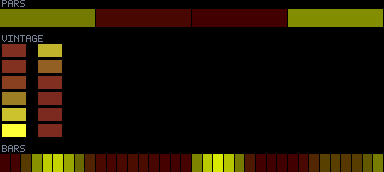
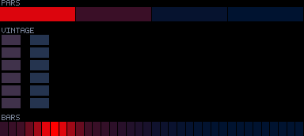
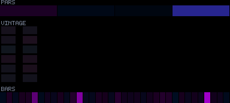
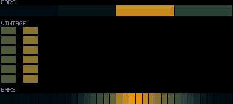
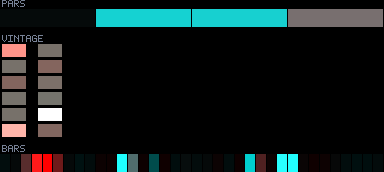

# Patterns 00–04

[🏠 Index](../catalog.md) · [Next (05–09) ➡](05-09.md)

---

### `00_golden_hour_wash`

**Identity:** Signature vintage-blinder warm wash  
**titanic** 970/970 lit  
**Status:** ④ blinder accent off-test_bench

---

### `01_cylon_sweep`

**Identity:** Red beam sweeping side to side  
**titanic** 970/970 lit  
**Status:** ④

---

### `02_phase_cathedral`

**Identity:** Per-section strict cp1↔cp2 phase field  
**titanic** 970/970 lit  
**Status:** ④

---

### `03_dual_axis_crush`

**Identity:** Beams collapse from both edges to centre  
**titanic** 762/970 lit  
**Status:** ⑤ partial titanic (geometry)

---

### `04_beat_folded_helix`

**Identity:** Pseudo-3D helix tunnel  
**titanic** 466/970 lit  
**Status:** ⑤ partial titanic; corr 0.83 (kick)

---

[🏠 Index](../catalog.md) · [Next (05–09) ➡](05-09.md)
