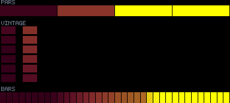
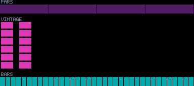
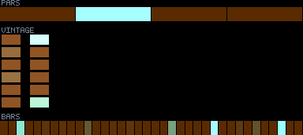
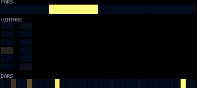
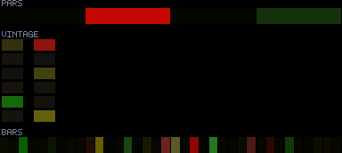

# Patterns 05–09

[🏠 Index](../catalog.md) · [⬅ Prev (00–04)](00-04.md) · [Next (10–14) ➡](10-14.md)

---

### `05_orbital_attractor_field`

**Identity:** Nearest-attractor focus field  
**titanic** 970/970 lit  
**Status:** ④

---

### `06_neon_elevator`

**Identity:** Light "car" riding the vertical stack  
**titanic** 970/970 lit  
**Status:** ④

---

### `07_shimmer`

**Identity:** Warm breathing wash + travelling glints  
**titanic** 970/970 lit  
**Status:** ④

---

### `08_ocean_liner`

**Identity:** Dark water wash + porthole flares  
**titanic** 970/970 lit  
**Status:** —

---

### `09_cyclone`

**Identity:** Swirling bright confetti storm  
**titanic** 970/970 lit  
**Status:** ④

---

[🏠 Index](../catalog.md) · [⬅ Prev (00–04)](00-04.md) · [Next (10–14) ➡](10-14.md)
