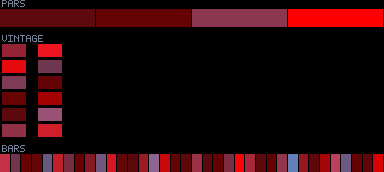
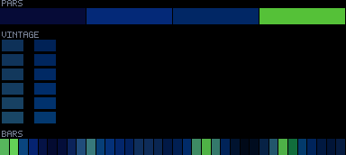
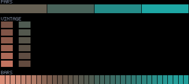
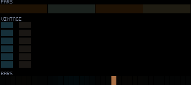
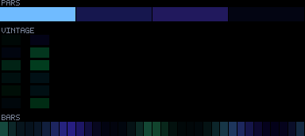

# Patterns 10–14

[🏠 Index](../catalog.md) · [⬅ Prev (05–09)](05-09.md) · [Next (15–19) ➡](15-19.md)

---

### `10_chasers`

**Identity:** Comet-head→tail chasers  
**titanic** 970/970 lit  
**Status:** —

---

### `11_bioluminescence`

**Identity:** cp1 swell + sharp cp2 crests + UV  
**titanic** 760/970 lit  
**Status:** ⑤ partial titanic

---

### `12_breathing`

**Identity:** Whole-rig inhale/exhale + white spark  
**titanic** 970/970 lit  
**Status:** ④

---

### `13_sparkle`

**Identity:** Two-colour wash + white-hot sparkles  
**titanic** 970/970 lit  
**Status:** ④

---

### `14_lunar_current`

**Identity:** Wide smooth moonlit currents  
**titanic** 970/970 lit  
**Status:** —

---

[🏠 Index](../catalog.md) · [⬅ Prev (05–09)](05-09.md) · [Next (15–19) ➡](15-19.md)
