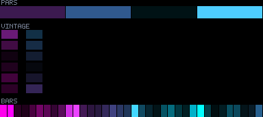
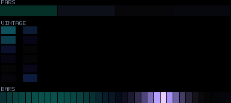
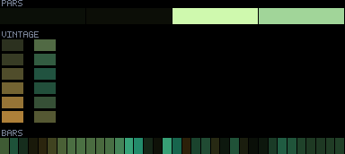
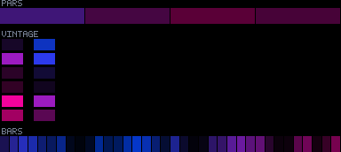
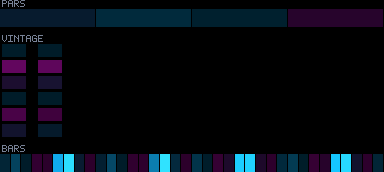

# Patterns 15–19

[🏠 Index](../catalog.md) · [⬅ Prev (10–14)](10-14.md) · [Next (20–24) ➡](20-24.md)

---

### `15_silk_prism_ribbons`

**Identity:** Satin ribbons sliding through the rig  
**titanic** 970/970 lit  
**Status:** —

---

### `16_ghost_tide_uv`

**Identity:** UV ghost-tide foam wash  
**titanic** 970/970 lit  
**Status:** —

---

### `17_rolling_color_dunes`

**Identity:** Incommensurate quasi-crystal dunes  
**titanic** 970/970 lit  
**Status:** ④

---

### `18_deep_space_lattice`

**Identity:** Crossed interference lattice  
**titanic** 970/970 lit  
**Status:** —

---

### `19_swaying_lattice_ballet`

**Identity:** Corps-de-ballet counter-sway  
**titanic** 970/970 lit  
**Status:** ④

---

[🏠 Index](../catalog.md) · [⬅ Prev (10–14)](10-14.md) · [Next (20–24) ➡](20-24.md)
