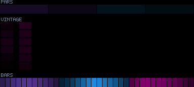
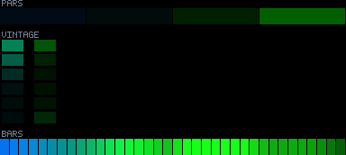
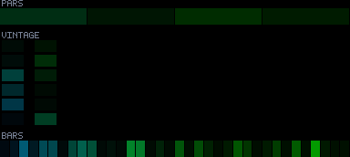
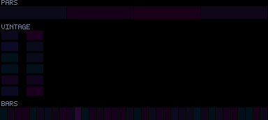
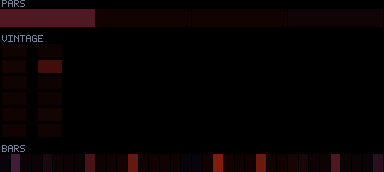

# Patterns 20–24

[🏠 Index](../catalog.md) · [⬅ Prev (15–19)](15-19.md) · [Next (25–29) ➡](25-29.md)

---

### `20_parametric_sway_field`

**Identity:** Soft glowing dancing nodes  
**titanic** 957/970 lit  
**Status:** —

---

### `21_pelagic_manta_rays`

**Identity:** Manta silhouettes gliding  
**titanic** 970/970 lit  
**Status:** —

---

### `22_abyssal_sway_garden`

**Identity:** Vertical fronds swaying  
**titanic** 970/970 lit  
**Status:** ④

---

### `23_prismatic_strange_attractors`

**Identity:** Orbiting gravity wells  
**titanic** 970/970 lit  
**Status:** dark-space vs corr trade-off (operator decision)

---

### `24_chromatic_murmuration`

**Identity:** Flock-attractor murmuration  
**titanic** 970/970 lit  
**Status:** —

---

[🏠 Index](../catalog.md) · [⬅ Prev (15–19)](15-19.md) · [Next (25–29) ➡](25-29.md)
