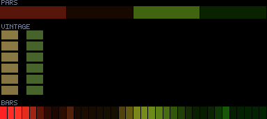
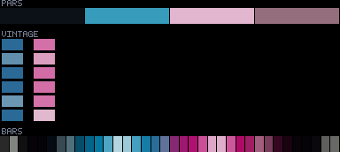
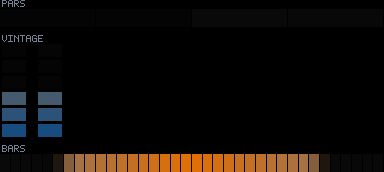
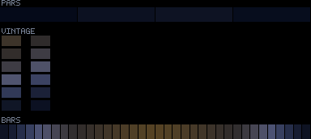

# Patterns 25–29

[🏠 Index](../catalog.md) · [⬅ Prev (20–24)](20-24.md) · [Next (30–34) ➡](30-34.md)

---

### `25_heartbeat`

**Identity:** lub-DUB double-pulse + blinder  
**titanic** 970/970 lit  
**Status:** ④; corr n/a (kick-gated)

---

### `26_dom_dancers_chevron`

**Identity:** Two dancers + spiral filigree  
**peak** 246 · **corr** 0.14 · **titanic** 970/970 lit  
**Status:** 🟢 corr n/a (kick-gated)

---

### `27_swipe`

**Identity:** Unified physical-ordinal swipe  
**peak** 253 · **corr** −0.05 · **titanic** 142/970 lit  
**Status:** 🟢 swipe (audio via swipePos); sparse/frame

---

### `28_spectrum_bloom`

**Identity:** Per-band fixture/axis bloom  
**peak** 59 · **corr** −0.02 · **titanic** 970/970 lit  
**Status:** 🔴🔵 dim + weak audio

---

### `29_kick_shockwave`

**Identity:** Expanding kick rings  
**peak** 44 · **corr** 1.00 · **titanic** 874/970 lit  
**Status:** 🔴 dim (corr great)

---

[🏠 Index](../catalog.md) · [⬅ Prev (20–24)](20-24.md) · [Next (30–34) ➡](30-34.md)
