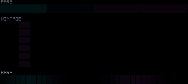
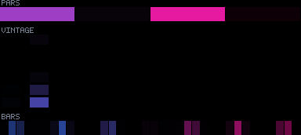
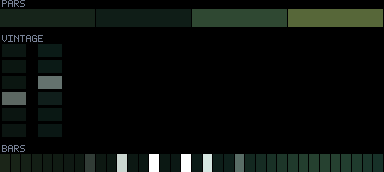
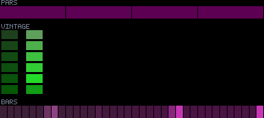
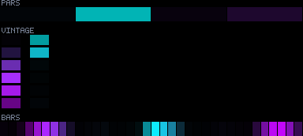

# Patterns 30–34

[🏠 Index](../catalog.md) · [⬅ Prev (25–29)](25-29.md) · [Next (35–39) ➡](35-39.md)

---

### `30_bass_comet`

**Identity:** Comet sweep + trail  
**peak** 242 · **corr** motion · **titanic** 80/970 lit  
**Status:** 🟢 bass→MOTION primary (brightness corr n/a); lit+animating

---

### `31_strobe_lattice`

**Identity:** Crisp strobing node lattice  
**peak** 151 · **corr** 0.70 · **titanic** 221/970 lit  
**Status:** 🔴 dim; sparse titanic

---

### `32_caustic_shimmer`

**Identity:** Layered caustic interference  
**peak** 255 · **corr** −0.04 · **titanic** 970/970 lit  
**Status:** 🔵 weak audio

---

### `33_aurora_breath`

**Identity:** Vertical aurora ribbons  
**peak** 218 · **corr** 0.67 · **titanic** 970/970 lit  
**Status:** 🟢 brightness decoupled; breathing

---

### `34_moire_interference`

**Identity:** Two-grid moiré beat  
**peak** 255 · **corr** 0.97 · **titanic** 964/970 lit  
**Status:** 🟢

---

[🏠 Index](../catalog.md) · [⬅ Prev (25–29)](25-29.md) · [Next (35–39) ➡](35-39.md)
