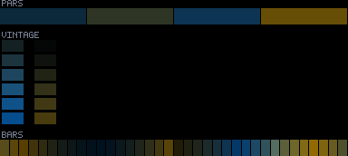
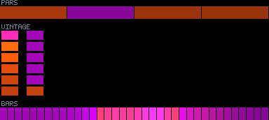
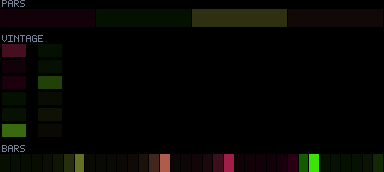
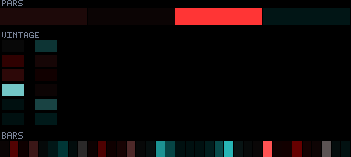

# Patterns 35–39

[🏠 Index](../catalog.md) · [⬅ Prev (30–34)](30-34.md) · [Next (40–44) ➡](40-44.md)

---

### `35_sparkle_rain`

**Identity:** Downward-drifting glints  
**peak** 212 · **corr** 0.54 · **titanic** 970/970 lit  
**Status:** 🟢 micLow level PRIMARY + kick; idle a touch dim

---

### `36_orbital_pulse`

**Identity:** Tight glow around orbiting wells  
**peak** 255 · **corr** 0.14 · **titanic** 970/970 lit  
**Status:** 🔵 weak audio

---

### `37_chevron_chase`

**Identity:** Sharp V-arrow chase  
**peak** 240 · **corr** 0.29 · **titanic** 970/970 lit  
**Status:** 🔵 weak-ish audio

---

### `38_prism_helix`

**Identity:** Crisp bright helical arms  
**peak** 255 · **corr** 0.95 · **titanic** 970/970 lit  
**Status:** 🟢

---

### `39_tide_riser`

**Identity:** Foam crest above a rising waterline  
**peak** 255 · **corr** −0.05 · **titanic** 970/970 lit  
**Status:** 🔵 weak audio

---

[🏠 Index](../catalog.md) · [⬅ Prev (30–34)](30-34.md) · [Next (40–44) ➡](40-44.md)
