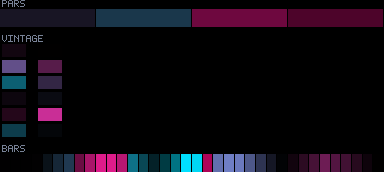
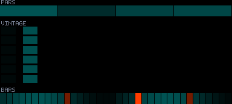
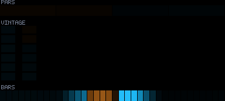
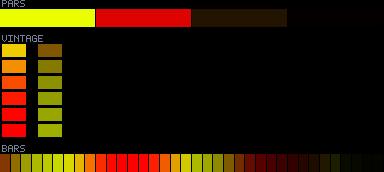
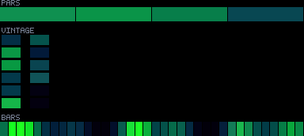

# Patterns 40–44

[🏠 Index](../catalog.md) · [⬅ Prev (35–39)](35-39.md) · [Next (45–49) ➡](45-49.md)

---

### `40_lissajous_weave`

**Identity:** Lissajous core over black  
**peak** 192 · **corr** 0.99 · **titanic** 757/970 lit  
**Status:** 🔴 just-dim; ⑤ partial

---

### `41_reaction_diffusion`

**Identity:** Gray-Scott reaction-diffusion  
**peak** 223 · **corr** 1.00 · **titanic** 970/970 lit  
**Status:** 🟢

---

### `42_phyllotaxis_spiral`

**Identity:** Sunflower phyllotaxis packing  
**peak** 167 · **corr** 0.11 · **titanic** 970/970 lit  
**Status:** 🔴🔵

---

### `43_golden_hour_pulse`

**Identity:** Warm sunset wash pulse  
**peak** 255 · **corr** 0.65 · **titanic** 970/970 lit  
**Status:** 🟢 max-react (dark idle by choice)

---

### `44_biolume_swell`

**Identity:** Biolume swell + UV  
**peak** 221 · **corr** −0.02 · **titanic** 970/970 lit  
**Status:** 🔵🟣

---

[🏠 Index](../catalog.md) · [⬅ Prev (35–39)](35-39.md) · [Next (45–49) ➡](45-49.md)
