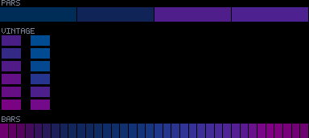
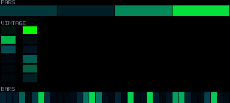
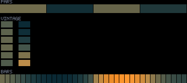
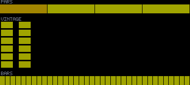
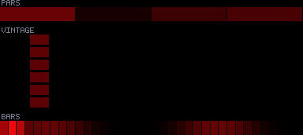

# Patterns 45–49

[🏠 Index](../catalog.md) · [⬅ Prev (40–44)](40-44.md) · [Next (50–54) ➡](50-54.md)

---

### `45_manta_drift`

**Identity:** Single manta wingspan gliding  
**peak** 176 · **corr** 0.09 · **titanic** 970/970 lit  
**Status:** 🔴🔵

---

### `46_abyssal_fronds`

**Identity:** Irrational-phase swaying fronds  
**peak** 255 · **corr** 0.60 · **titanic** 970/970 lit  
**Status:** 🟢 brightness decoupled; spatial breath

---

### `47_quasicrystal_dunes`

**Identity:** 5-wave quasicrystal interference  
**peak** 186 · **corr** 0.10 · **titanic** 970/970 lit  
**Status:** 🔴🔵

---

### `48_heartbeat_drive`

**Identity:** micLow-driven resting muscle  
**peak** 12 · **corr** 0.13 · **titanic** 970/970 lit  
**Status:** ⚫ near-dark (peak 12)

---

### `49_cylon_crush`

**Identity:** Cylon+crush amalgam  
**peak** 180 · **corr** 0.90 · **titanic** 829/970 lit  
**Status:** 🔴 just-dim (corr great)

---

[🏠 Index](../catalog.md) · [⬅ Prev (40–44)](40-44.md) · [Next (50–54) ➡](50-54.md)
