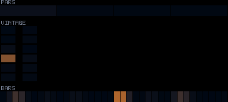
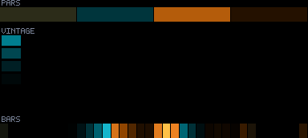
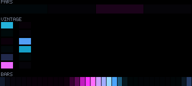
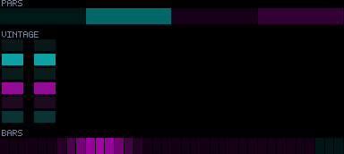
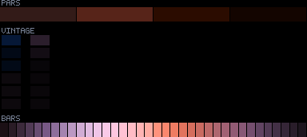

# Patterns 50–54

[🏠 Index](../catalog.md) · [⬅ Prev (45–49)](45-49.md) · [Next (57–58) ➡](57-58.md)

---

### `50_phase_cathedral_hd`

**Identity:** Irrational node lattice  
**peak** 231 · **corr** 0.65 · **titanic** 970/970 lit  
**Status:** 🟢 levelMul anchor; dark idle

---

### `51_confetti_cyclone`

**Identity:** Sparks over true black  
**peak** 58 · **corr** −0.05 · **titanic** 420/970 lit  
**Status:** 🔴🔵; sparse titanic

---

### `52_silk_ribbons`

**Identity:** Crisp-core silk ribbons  
**peak** 93 · **corr** 0.06 · **titanic** 970/970 lit  
**Status:** 🔴🔵

---

### `53_neon_elevator_hd`

**Identity:** Tall elevator shaft bottom→top  
**peak** 141 · **corr** 0.82 · **titanic** 970/970 lit  
**Status:** 🔴 dim (corr good)

---

### `54_murmuration_storm`

**Identity:** Flock density field  
**peak** 255 · **corr** 0.39 · **titanic** 835/970 lit  
**Status:** 🟢 flash seam fixed (Δ 38×→6.7×); corr kick-gated

---

[🏠 Index](../catalog.md) · [⬅ Prev (45–49)](45-49.md) · [Next (57–58) ➡](57-58.md)
