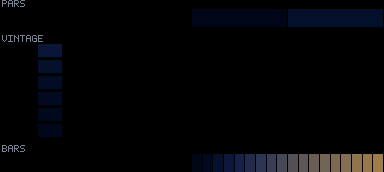

# Patterns 57–58

[🏠 Index](../catalog.md) · [⬅ Prev (50–54)](50-54.md)

---

### `57_ink_diffuse`

**Identity:** Dye blooms diffusing in water  
**peak** 255 · **corr** 0.09 · **titanic** 970/970 lit  
**Status:** 🔵🟣

---

### `58_lighthouse_solo`

**Identity:** Single far-field lighthouse sweep  
**peak** 122 · **corr** −0.11 · **titanic** 485/970 lit  
**Status:** 🔴🔵; sparse by design

---

[🏠 Index](../catalog.md) · [⬅ Prev (50–54)](50-54.md)
